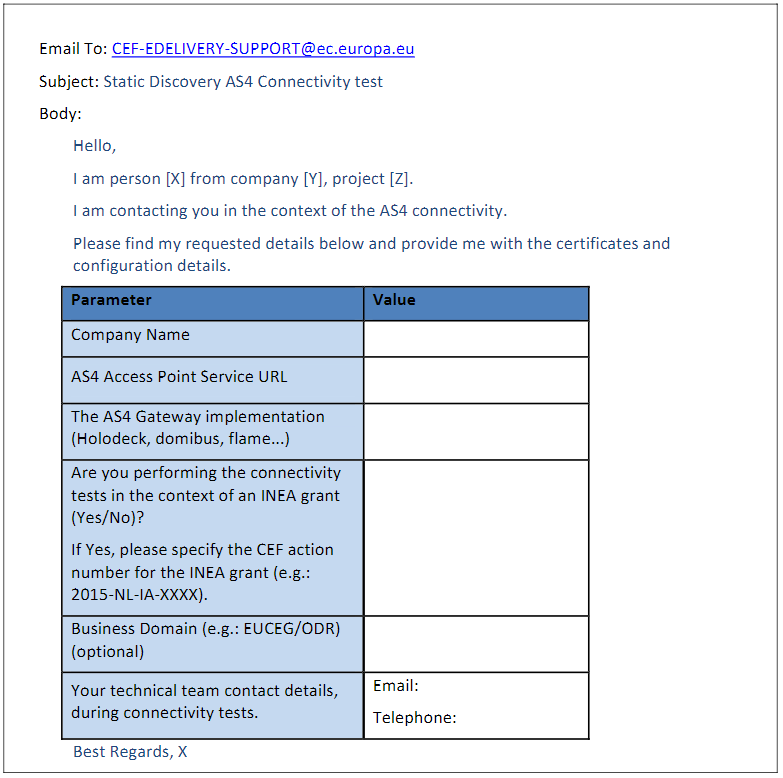

# CEF connectivity test

In this tutorial we will perform a static discovery AS4 connectivity test.

* [Step 1 - Send a Registration Request to CEF Support](#step1)
* [Step 2 - Setting up a CEF adapted Access Point](#step2)
* [Step 3 - Sending a message to CEF](#step4)
* [Step 4 - Receiving a message from CEF](#step5)

## <a name="step1"></a>Step 1 - Send a Registration Request to CEF Support

The Static Discovery procedure implies that the Participant Access Point is configured with the static
address of the European Commission Access Point and vice versa.
Provide the information of your company's AS4 Access Point to the CEF eDelivery Support team.

To initiate the process of connectivity testing between your Access Point and the test Access Point, send
the information in the below format to the CEF eDelivery Support team.Static Discovery form:



Please note! The AS4 Access Point Service URL should end with /as4 or /oxalis/as4 if you are going to use Tomcat.
E.g. https://my.host.com/oxalis/as4

### Registration details received from CEF Support

As a response, you will receive an email with:

* The Certificate for your Access Point (Truststore and Keystore).
* The Endpoint URL of the CEF test AS4 Access Point

You will also receive some other files, that you can ignore.

## <a name="step2"></a>Step 2 - Setting up a CEF adapted Access Point

Please follow the [installation instructions](../installation/index.md) to install the Access Point.

The oxalis.conf configuration of the AP should look like this:

```properties
oxalis.keystore {
     # Relative to OXALIS_HOME
     path=ceftestpartyXXgwkeystore.jks
     password = xxx
     key.alias = ceftestparty93gw
     key.password = xxx
}

security.truststore.ap=ceftestpartyXXgwtruststore.jks
security.truststore.password=XXXX

# Changes pmode and a few other things to adapt to the connectivity test
oxalis.as4.type=cef-connectivity

# CEF doesn't send a SBD
oxalis.header.parser=dummy

lookup.locator.hostname="acc.edelivery.tech.ec.europa.eu/edelivery-sml/"
lookup.locator.class = no.difi.vefa.peppol.lookup.locator.BusdoxLocator

security.validator.class = no.difi.vefa.peppol.security.util.EmptyCertificateValidator

oxalis.path.inbound = /var/peppol/IN

oxalis.logging.config=logback.xml
```
## <a name="step4"></a>Step 3 - Sending a message to CEF

First you should test that your AP works as expected by using [oxalis-standalone](../installation/standalone.md).

```bash
java -DOXALIS_HOME=/c/dev/cef/.oxalis \
  -classpath "standalone/*;as4/*" \
  eu.sendregning.oxalis.Main \
  -cert ./ceftestpartyXXgw.crt \
  -f payload.xml \
  --protocol peppol-transport-as4-v2_0 \
  -u "<URL of your AP>"
```

The ./ceftestpartyXXgw.crt certificate can be extracted from the truststore using a tool like Keystore Explorer.
Look further down for information about the content of the payload.xml.

The oxalis.conf in OXALIS_HOME of the oxalis-standalone outbound should be similar to this:

```xml
oxalis.keystore {
     # Relative to OXALIS_HOME
     path=ceftestpartyXXgwkeystore.jks
     password = XXXX
     key.alias = ceftestpartyXXgw
     key.password = XXXX
}

security.truststore.ap=ceftestpartyXXgwtruststore.jks
security.truststore.password=XXXX

lookup.locator.hostname="acc.edelivery.tech.ec.europa.eu/edelivery-sml/"

oxalis.as4.type=cef-connectivity

oxalis.logging.config=logback.xml
```


Example of sending to CEF-connectivity standalone URL using oxalis-standalone
```bash
java -DOXALIS_HOME=/c/dev/cef/.oxalis \
  -classpath "standalone/*;as4/*" \
  eu.sendregning.oxalis.Main \
  -cert ./cefsupportgw.cer \
  -f payload.xml \
  --protocol peppol-transport-as4-v2_0 \
  -u "<replace with the URL in the email you received from CEF-EDELIVERY-SUPPORT>"
```
The cefsupportgw.cer can be exported from the truststore JKS. On Windows we recommend using Keystore Explorer for an easy export.


Here is a template for the payload.xml:

```xml
<?xml version="1.0" encoding="UTF-8"?>
<StandardBusinessDocument xmlns="http://www.unece.org/cefact/namespaces/StandardBusinessDocumentHeader">
    <StandardBusinessDocumentHeader>
        <HeaderVersion>1.0</HeaderVersion>
        <Sender>
            <!-- This Sender section describes the PEPPOL Sender -->
            <!-- It corresponds to an OriginalSender in AS4 -->
          <Identifier>urn:oasis:names:tc:ebcore:partyid-type:unregistered:ceftestpartyXXgw</Identifier>
      </Sender>
      <Receiver>
           <!-- This Sender section describes the PEPPOL Receiver -->
           <!-- It corresponds to an FinalRecipient in AS4 -->
           <Identifier>urn:oasis:names:tc:ebcore:partyid-type:unregistered:cefsupportgw</Identifier>
        </Receiver>
        <DocumentIdentification>
            <!-- This DocumentIdentification section describes the content of the payload -->
            <!-- It is noe essential to the CEF connectivity test, but is needed for a valid SBDH -->

            <Standard>NONE</Standard>
            <TypeVersion>1.0</TypeVersion>
            <InstanceIdentifier>d8b5b55f-508d-438a-8363-2e5e0d7820fc</InstanceIdentifier>
            <Type>CEF Connectivity test</Type>
            <CreationDateAndTime>2020-01-15T11:45:00.000+02:00</CreationDateAndTime>
        </DocumentIdentification>
        <BusinessScope>
            <Scope>
                <!-- This Scope section describes the PEPPOL DocumentType -->
                <!-- It corresponds to an Action in AS4 (PMode[1].BusinessInfo.Action) -->

                <Type>DOCUMENTID</Type>
                <!-- We add an empty Identifier element to set the 'DocumentIdentifier Schema' to en empty string -->
                <!-- If we do not do this Oxalis-Standalone will add a default 'DocumentType Schema' that will prefix the Action with "busdox-docid-qns", or what is defined in this element, and "::" -->
                <Identifier/>
                <InstanceIdentifier>connectivity::cef##connectivity::submitMessage</InstanceIdentifier>
            </Scope>
            <Scope>
                <!-- This Scope section describes the PEPPOL Process -->
                <!-- It corresponds to an Service in AS4 (PMode[1].BusinessInfo.Service) -->

                <Type>PROCESSID</Type>
                <!-- This Identifier describes the PEPPOL 'Process Schema' and corresponds to a Service.Type in AS4 (PMode[].BusinessInfo.Service.type) -->
                <Identifier>e-delivery</Identifier>
                <!-- This InstanceIdentifier describes the PEPPOL 'Process Value' and corresponds to an Service in AS4 (PMode[1].BusinessInfo.Service) -->
                <InstanceIdentifier>http://ec.europa.eu/e-delivery/services/connectivity-service</InstanceIdentifier>
            </Scope>
        </BusinessScope>
    </StandardBusinessDocumentHeader>
    <Request> eDelivery AS4 Connectivity test. Sending Message </Request>
</StandardBusinessDocument>
```

You need to change the sender to match the test party you have received from CEF support.
The DocumentIdentification/InstanceIdentifier should be replaced with a new UUID. You can generate a new one (here)[https://www.uuidgenerator.net/].

After sending the message to CEF, you should do the following:

* Contact  the CEF  eDelivery  Support  team  by  email  indicating  that  the request  message  has been sent.

* The CEF eDelivery Support team will check if the request has been correctly received and will verify its content.

* The CEF  eDelivery  Support  team  will  inform  you  about  the  status  of  the  request  and  if positive,  will
  send  back a XML  file  from the  AS4  Access Point  of  the  platform  to your AS4 Access Point:

 ```xml
 <?xml version="1.0" encoding="UTF-8"?>
 <Response>eDelivery AS4 Connectivity test conducted with success</ Response>
 ```

## <a name="step5"></a>Step 4 - Receiving a message from CEF

If the file is received successfully, it should be located in a subfolder of the folder specified in oxalis.path.inbound

There will be two files. One containing the payload (*.doc.xml) and one (*.receipt.dat).

Inform the CEF eDelivery Support team by email about the status of the response.

If both the request and response message have been sent/received correctly, the connectivity test has been completed successfully.

