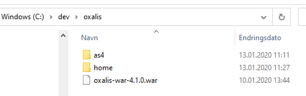

# Install Oxalis Inbound (Tomcat 8+)

## Oxalis

First you should download the [oxalis-war-4.1.2.war](https://github.com/difi/oxalis/releases/download/oxalis-4.1.2/oxalis-war-4.1.2.war) file
from this [page](https://github.com/difi/oxalis/releases) and
put it a directory of your choice. We recommend naming the folder oxalis.

Then you should download the [Oxalis-AS4 distribution](https://github.com/difi/Oxalis-AS4/releases/download/4.1.9/oxalis-as4-4.1.9-dist.zip)
from this [page](https://github.com/difi/Oxalis-AS4/releases) and unzip
the files to a new folder of your choice. We recommend creating a folder named as4 inside the folder containing the WAR file.

Also create a folder named home inside the oxalis folder and place the oxalis.conf file, together with the necessary JKS files.

Then you should have something looking like this like this:



For general instructions on how to install and use Oxalis, please refer to [oxalis installation guide](https://github.com/difi/oxalis/blob/master/doc/installation.md).

## Tomcat installation

First you need to [download](https://tomcat.apache.org/download-90.cgi) Tomcat and unzip the files to a directory.


Then you should set the CATALINA_BASE environment variable to the chosen installation folder.

## Tomcat configuration for Oxalis 

The next step is to create a folder named Catalina in the Tomcat conf directory.

```bash
cd conf
mkdir Catalina 
```

And inside the newly created Catalina folder - create a folder named localhost.

```bash
cd Catalina
mkdir localhost 
```

Inside this localhost folder - create a file named oxalis.xml containing:

```xml
<?xml version="1.0" encoding="UTF-8"?>
<!-- For a default Tomcat setup, name this file 'oxalis.xml' and place it in the following directory -->
<!-- $CATALINA_BASE/conf/Catalina/localhost/ -->
<!-- this will expose the as4 endpoint on http://localhost:8080/oxalis/as4 -->


<!-- The Context element represents our application. -->
<!-- The 'docBase' attribute will define the main application to be run. -->
<!-- For more information see https://tomcat.apache.org/tomcat-8.5-doc/config/context.html -->
<Context docBase="C:\dev\oxalis\oxalis-war-4.1.2.war"  >
    
   <!-- Optionally define the OXALIS_HOME environment variable  -->
   <Environment name="OXALIS_HOME" value="C:\dev\oxalis\home" type="java.lang.String" override="false" />

   <!-- Here we can add a list of additional resources to add to the application --> 
   <!-- For more information see https://tomcat.apache.org/tomcat-8.5-doc/config/resources.html -->
   <Resources className="org.apache.catalina.webresources.ExtractingRoot">
            
      <!-- Add the other dependencies of oxalis -->
      <!--
      <PreResources 
          base="/path/to/oxalis/dir" 
          className="org.apache.catalina.webresources.DirResourceSet"
          webAppMount="/WEB-INF/lib"
          readOnly="true" />
      --> 
      
      <!-- Add this resource after (this resource wil override files found in 'Context') the one we defined in the context element -->
      <PostResources
        base="C:\dev\oxalis\as4" 
        className="org.apache.catalina.webresources.DirResourceSet"
        webAppMount="/WEB-INF/lib"
        />  
      
      <!-- The name 'PreResources' and 'PostResources' refers to whether the resources will be added before or after the resource we defined in the 'Context' element -->
      <!-- There is also 'JarResources' that will let us alter the content of the 'Context' resource itself -->
      <!-- the precedence only affects witch version to use in case multiple resources provide the same content (the latest element will win) -->
      
   </Resources>

</Context>
```

This is only an example deployment XML file for tomcat 8+. Ensure that your file locations match with the paths in the XML.

Now you are ready to start the Tomcat server.

# Verifying the installation

The easiest way to see that the AS4 endpoint is up and running is to visit its endpoint address.
If we now visit ``localhost:8080/oxalis/as4`` we will be greeted with the message ``Hello AS4 world``

