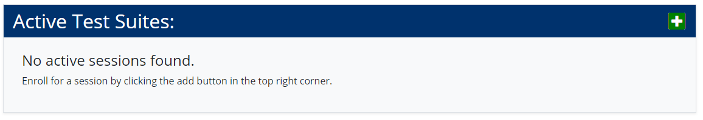
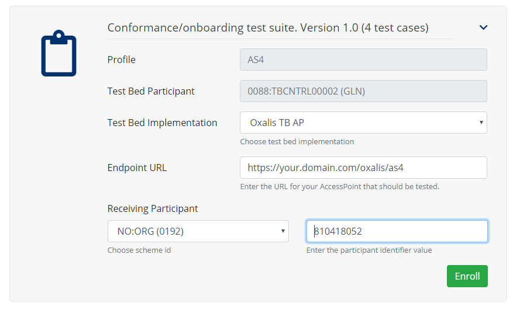
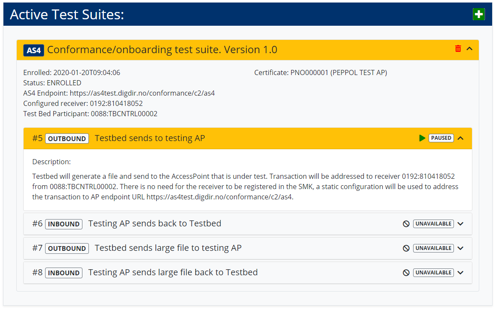
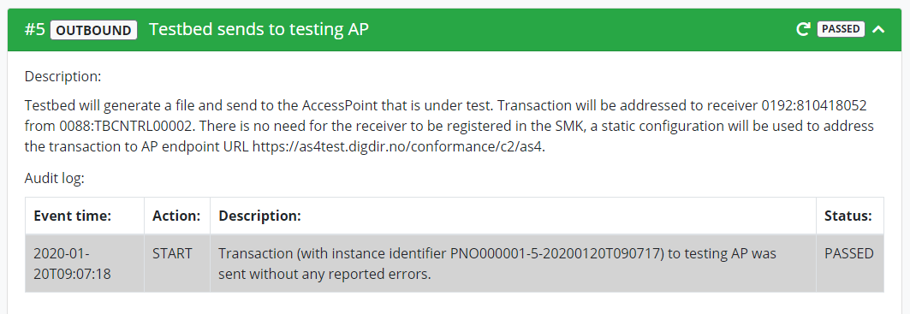
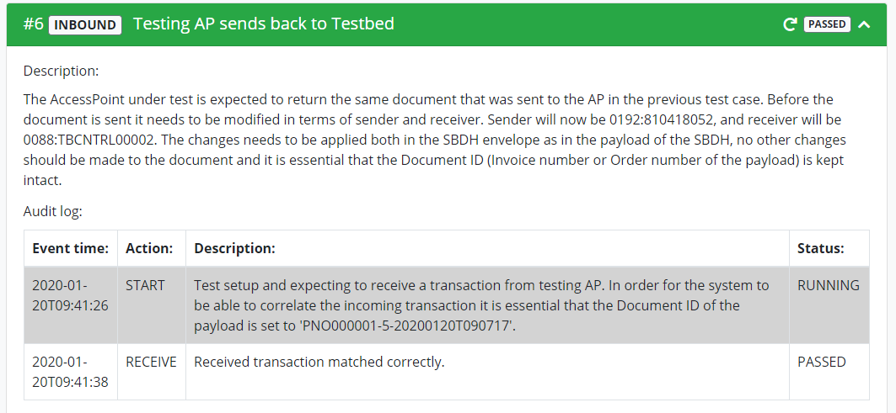
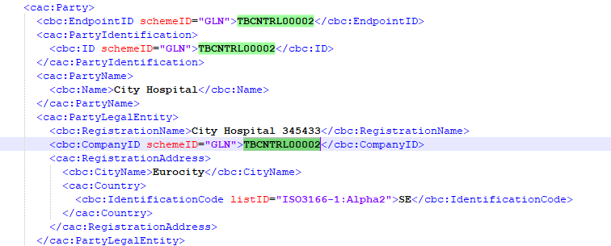
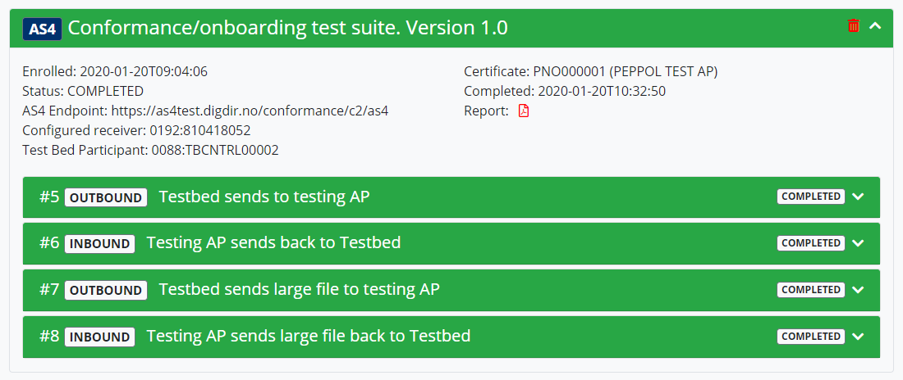

# OpenPEPPOL Test Bed

This document intends to help with the setup of Oxalis AS4 for testing with the PEPPOL Test Bed and guide your through the testing procedure.

## Prerequisites and configuration

The following prerequisites must be fulfilled before starting this tutorial:

* You need a PEPPOL test certificate and truststore.

* A domain to put your AP behind supporting HTTPS with certificate chains to Certificate Authorities (CAs) which are trusted by the
PEPPOL community. Your certificate must be trusted by both Microsoft and Oracle CAs. Self-signed certificates
are considered non-compliant and will not be accepted when onboarding as a PEPPOL service provider. To test
your SSL configuration, go to [https://www.ssllabs.com/ssltest/](https://www.ssllabs.com/ssltest/). It must be a grade A or above. This will
eventually also be controlled by the OpenPEPPOL Operating Office.

* Your PEPPOL Test certificate is installed in your browser so that your are able to open the [OpenPEPPOL Centralized Testbed](https://testbed.peppol.eu/secure/suite/view).

## Setting up an Oxalis-AS4 Access Point

Please follow one of the inbound installation procedures found [here](../installation/index.md).

The Oxalis configuration file (oxalis.conf) for your AP should look something like this:

```properties
oxalis.keystore {
     # Relative to OXALIS_HOME
     path=peppol-g2-test-2018-05-28.jks
     password = xxx
     key.alias = ap
     key.password = xxx
}

# The folder where the incoming messages will be stored
oxalis.path.inbound = /var/peppol/IN

# Optional
oxalis.logging.config=logback.xml
```

You need to specify the correct passwords and name of the keystore.

Here is an example of a verbose logback.xml:
```xml
<?xml version="1.0" encoding="UTF-8"?>
<configuration debug="false">

    <appender name="STDOUT" class="ch.qos.logback.core.ConsoleAppender">
        <encoder>
            <pattern>%d %p [%c] %m %n</pattern>
        </encoder>
    </appender>

    <logger name="org.apache.cxf" level="debug"/>

    <root level="info">
        <appender-ref ref="STDOUT"/>
    </root>

</configuration>
```

You now need to configure your domain so that the newly installed AP is reachable by HTTPS.
The URL might be something like this:

https://your.domain.com/oxalis/as4

This URL should reply with:

```text
Hello AS4 world
```

You are now ready to go to the [OpenPEPPOL Centralized Testbed](https://testbed.peppol.eu/secure/suite/view) and start the testing.

## Using the OpenPEPPOL Test Bed

You will see a startup screen with the following box:



### Enrollment

To enroll for a test suite, please click on the  button.

You should choose the AS4 profile and the URL to your AS4 Access Point. For the Receiving Participant you can specify scheme NO:ORG (0192) and participant identifier 810418052.



After pressing the Enroll button, you should see something like this:



### Outbound - Testbed sends to testing AP

Then you should go on with '#5 Outbound - Testbed sends to testing AP', by pressing the play button.
The testbed now sends a message to your AP. If successful your should see something like this:



### Inbound - Testing AP sends back to Testbed

Your AP should have received a file in the inbound folder. Please locate it and copy it to the folder where you have installed the [oxalis_standalone](../installation/standalone.md) outbound application.

The standalone outbound application should use a configuration similar to this:

```properties
oxalis.keystore {
     # Relative to OXALIS_HOME
     path=peppol-g2-test-2018-05-28.jks
     password = xxx
     key.alias = ap
     key.password = xxx
}
```

The file that your AP received from the Test bed should look similar to this:

```xml
<?xml version="1.0" encoding="UTF-8" standalone="no"?>
<StandardBusinessDocument xmlns="http://www.unece.org/cefact/namespaces/StandardBusinessDocumentHeader">
  <StandardBusinessDocumentHeader>
    <HeaderVersion>1.0</HeaderVersion>
    <Sender>
      <Identifier Authority="iso6523-actorid-upis">0088:TBCNTRL00002</Identifier>
    </Sender>
    <Receiver>
      <Identifier Authority="iso6523-actorid-upis">0192:810418052</Identifier>
    </Receiver>
    <DocumentIdentification>
      <Standard>urn:oasis:names:specification:ubl:schema:xsd:Invoice-2</Standard>
      <TypeVersion>2.1</TypeVersion>
      <InstanceIdentifier>PNO000001-5-20200120T090717</InstanceIdentifier>
      <Type>Invoice</Type>
      <CreationDateAndTime>2020-01-20T09:07:17.589Z</CreationDateAndTime>
    </DocumentIdentification>
    <BusinessScope>
      <Scope>
        <Type>DOCUMENTID</Type>
        <InstanceIdentifier>urn:oasis:names:specification:ubl:schema:xsd:Invoice-2::Invoice##urn:www.cenbii.eu:transaction:biitrns010:ver2.0:extended:urn:www.peppol.eu:bis:peppol5a:ver2.0::2.1</InstanceIdentifier>
      </Scope>
      <Scope>
        <Type>PROCESSID</Type>
        <InstanceIdentifier>urn:www.cenbii.eu:profile:bii05:ver2.0</InstanceIdentifier>
      </Scope>
    </BusinessScope>
  </StandardBusinessDocumentHeader>
  <Invoice xmlns="urn:oasis:names:specification:ubl:schema:xsd:Invoice-2" xmlns:cac="urn:oasis:names:specification:ubl:schema:xsd:CommonAggregateComponents-2" xmlns:cbc="urn:oasis:names:specification:ubl:schema:xsd:CommonBasicComponents-2" xmlns:ccts="urn:un:unece:uncefact:documentation:2" xmlns:qdt="urn:oasis:names:specification:ubl:schema:xsd:QualifiedDatatypes-2" xmlns:udt="urn:un:unece:uncefact:data:specification:UnqualifiedDataTypesSchemaModule:2">
	<cbc:UBLVersionID>2.1</cbc:UBLVersionID>
	<cbc:CustomizationID>urn:www.cenbii.eu:transaction:biitrns010:ver2.0:extended:urn:www.peppol.eu:bis:peppol5a:ver2.0</cbc:CustomizationID>
	<cbc:ProfileID>urn:www.cenbii.eu:profile:bii05:ver2.0</cbc:ProfileID>
	<cbc:ID>PNO000001-5-20200120T090717</cbc:ID>
	<cbc:IssueDate>2013-04-10</cbc:IssueDate>
	<cbc:InvoiceTypeCode listID="UNCL1001">380</cbc:InvoiceTypeCode>
	<cbc:Note>Contract was established through our website</cbc:Note>
	<cbc:DocumentCurrencyCode listID="ISO4217">DKK</cbc:DocumentCurrencyCode>
	<cac:InvoicePeriod>
		<cbc:StartDate>2013-01-01</cbc:StartDate>
		<cbc:EndDate>2013-04-01</cbc:EndDate>
	</cac:InvoicePeriod>
	<cac:ContractDocumentReference>
		<cbc:ID>SUBSCR571</cbc:ID>
		<cbc:DocumentType>Contract</cbc:DocumentType>
	</cac:ContractDocumentReference>
	<cac:AccountingSupplierParty>
		<cac:Party>
			<cbc:EndpointID schemeID="GLN">TBCNTRL00002</cbc:EndpointID>
			<cac:PartyIdentification>
				<cbc:ID schemeID="GLN">TBCNTRL00002</cbc:ID>
			</cac:PartyIdentification>
			<cac:PartyName>
				<cbc:Name>SubscriptionSeller.</cbc:Name>
			</cac:PartyName>
			<cac:PostalAddress>
				<cbc:StreetName>Main street 2, Building 4</cbc:StreetName>
				<cbc:CityName>Big city</cbc:CityName>
				<cbc:PostalZone>54321</cbc:PostalZone>
				<cac:Country>
					<cbc:IdentificationCode listID="ISO3166-1:Alpha2">DK</cbc:IdentificationCode>
				</cac:Country>
			</cac:PostalAddress>
			<cac:PartyTaxScheme>
				<cbc:CompanyID schemeID="DK:SE">DK16356706</cbc:CompanyID>
				<cac:TaxScheme>
					<cbc:ID>VAT</cbc:ID>
				</cac:TaxScheme>
			</cac:PartyTaxScheme>
			<cac:PartyLegalEntity>
				<cbc:CompanyID schemeID="DK:CVR">DK16356706</cbc:CompanyID>
			</cac:PartyLegalEntity>
			<cac:Contact>
				<cbc:ElectronicMail>antonio@SubscriptionsSeller.dk</cbc:ElectronicMail>
			</cac:Contact>
		</cac:Party>
	</cac:AccountingSupplierParty>
	<cac:AccountingCustomerParty>
		<cac:Party>
			<cbc:EndpointID schemeID="NO:ORG">810418052</cbc:EndpointID>
			<cac:PartyIdentification>
				<cbc:ID schemeID="NO:ORG">810418052</cbc:ID>
			</cac:PartyIdentification>
			<cac:PartyName>
				<cbc:Name>Buyercompany ltd</cbc:Name>
			</cac:PartyName>
			<cac:PostalAddress>
				<cbc:StreetName>Anystreet, Building 1</cbc:StreetName>
				<cbc:CityName>Anytown</cbc:CityName>
				<cbc:PostalZone>101</cbc:PostalZone>
				<cac:Country>
					<cbc:IdentificationCode listID="ISO3166-1:Alpha2">NO</cbc:IdentificationCode>
				</cac:Country>
			</cac:PostalAddress>
		</cac:Party>
	</cac:AccountingCustomerParty>
	<cac:PaymentMeans>
		<cbc:PaymentMeansCode listID="UNCL4461">42</cbc:PaymentMeansCode>
		<cbc:PaymentDueDate>2013-05-10</cbc:PaymentDueDate>
		<cbc:PaymentID>Payref1</cbc:PaymentID>
		<cac:PayeeFinancialAccount>
			<cbc:ID schemeID="LOCAL">DK1212341234123412</cbc:ID>
		</cac:PayeeFinancialAccount>
	</cac:PaymentMeans>
	<cac:AllowanceCharge>
		<cbc:ChargeIndicator>true</cbc:ChargeIndicator>
		<cbc:AllowanceChargeReasonCode listID="UNCL4465">94</cbc:AllowanceChargeReasonCode>
		<cbc:AllowanceChargeReason>Freight charge</cbc:AllowanceChargeReason>
		<cbc:Amount currencyID="DKK">100.00</cbc:Amount>
		<cac:TaxCategory>
			<cbc:ID schemeID="UNCL5305">S</cbc:ID>
			<cbc:Percent>25</cbc:Percent>
			<cac:TaxScheme>
				<cbc:ID>VAT</cbc:ID>
			</cac:TaxScheme>
		</cac:TaxCategory>
	</cac:AllowanceCharge>
	<cac:TaxTotal>
		<cbc:TaxAmount currencyID="DKK">225.00</cbc:TaxAmount>
		<cac:TaxSubtotal>
			<cbc:TaxableAmount currencyID="DKK">900.00</cbc:TaxableAmount>
			<cbc:TaxAmount currencyID="DKK">225.00</cbc:TaxAmount>
			<cac:TaxCategory>
				<cbc:ID schemeID="UNCL5305">S</cbc:ID>
				<cbc:Percent>25</cbc:Percent>
				<cac:TaxScheme>
					<cbc:ID>VAT</cbc:ID>
				</cac:TaxScheme>
			</cac:TaxCategory>
		</cac:TaxSubtotal>
	</cac:TaxTotal>
	<cac:LegalMonetaryTotal>
		<cbc:LineExtensionAmount currencyID="DKK">800.00</cbc:LineExtensionAmount>
		<cbc:TaxExclusiveAmount currencyID="DKK">900.00</cbc:TaxExclusiveAmount>
		<cbc:TaxInclusiveAmount currencyID="DKK">1125.00</cbc:TaxInclusiveAmount>
		<cbc:ChargeTotalAmount currencyID="DKK">100.00</cbc:ChargeTotalAmount>
		<cbc:PayableAmount currencyID="DKK">1125.00</cbc:PayableAmount>
	</cac:LegalMonetaryTotal>
	<cac:InvoiceLine>
		<cbc:ID>1</cbc:ID>
		<cbc:InvoicedQuantity unitCode="C62" unitCodeListID="UNECERec20">1</cbc:InvoicedQuantity>
		<cbc:LineExtensionAmount currencyID="DKK">800.00</cbc:LineExtensionAmount>
		<cac:Item>
			<cbc:Description>Paper Subscription fee 1st quarter</cbc:Description>
			<cbc:Name>Paper Subscription</cbc:Name>
			<cac:ClassifiedTaxCategory>
				<cbc:ID schemeID="UNCL5305">S</cbc:ID>
				<cbc:Percent>25</cbc:Percent>
				<cac:TaxScheme>
					<cbc:ID>VAT</cbc:ID>
				</cac:TaxScheme>
			</cac:ClassifiedTaxCategory>
		</cac:Item>
		<cac:Price>
			<cbc:PriceAmount currencyID="DKK">800.00</cbc:PriceAmount>
		</cac:Price>
	</cac:InvoiceLine>
</Invoice>
</StandardBusinessDocument>
```

Before you can send it back to the testbed, you have to swap the Sender and Receiver in the StandardBusinessDocumentHeader.
In addition the same thing has to be done in the Invoice payload. Just search for the parts looking like this:

```xml
<cbc:EndpointID schemeID="NO:ORG">810418052</cbc:EndpointID>
<cac:PartyIdentification>
	<cbc:ID schemeID="NO:ORG">810418052</cbc:ID>
</cac:PartyIdentification>
```

and swap them with:

```xml
<cbc:EndpointID schemeID="GLN">TBCNTRL00002</cbc:EndpointID>
<cac:PartyIdentification>
	<cbc:ID schemeID="GLN">TBCNTRL00002</cbc:ID>
</cac:PartyIdentification> 
```

Then your file should look like this:

```xml
<?xml version="1.0" encoding="UTF-8" standalone="no"?>
<StandardBusinessDocument xmlns="http://www.unece.org/cefact/namespaces/StandardBusinessDocumentHeader">
  <StandardBusinessDocumentHeader>
    <HeaderVersion>1.0</HeaderVersion>
    <Sender>
      <Identifier Authority="iso6523-actorid-upis">0192:810418052</Identifier>
    </Sender>
    <Receiver>
      <Identifier Authority="iso6523-actorid-upis">0088:TBCNTRL00002</Identifier>
    </Receiver>
    <DocumentIdentification>
      <Standard>urn:oasis:names:specification:ubl:schema:xsd:Invoice-2</Standard>
      <TypeVersion>2.1</TypeVersion>
      <InstanceIdentifier>PNO000001-5-20200120T090717</InstanceIdentifier>
      <Type>Invoice</Type>
      <CreationDateAndTime>2020-01-20T09:07:17.589Z</CreationDateAndTime>
    </DocumentIdentification>
    <BusinessScope>
      <Scope>
        <Type>DOCUMENTID</Type>
        <InstanceIdentifier>urn:oasis:names:specification:ubl:schema:xsd:Invoice-2::Invoice##urn:www.cenbii.eu:transaction:biitrns010:ver2.0:extended:urn:www.peppol.eu:bis:peppol5a:ver2.0::2.1</InstanceIdentifier>
      </Scope>
      <Scope>
        <Type>PROCESSID</Type>
        <InstanceIdentifier>urn:www.cenbii.eu:profile:bii05:ver2.0</InstanceIdentifier>
      </Scope>
    </BusinessScope>
  </StandardBusinessDocumentHeader>
  <Invoice xmlns="urn:oasis:names:specification:ubl:schema:xsd:Invoice-2" xmlns:cac="urn:oasis:names:specification:ubl:schema:xsd:CommonAggregateComponents-2" xmlns:cbc="urn:oasis:names:specification:ubl:schema:xsd:CommonBasicComponents-2" xmlns:ccts="urn:un:unece:uncefact:documentation:2" xmlns:qdt="urn:oasis:names:specification:ubl:schema:xsd:QualifiedDatatypes-2" xmlns:udt="urn:un:unece:uncefact:data:specification:UnqualifiedDataTypesSchemaModule:2">
	<cbc:UBLVersionID>2.1</cbc:UBLVersionID>
	<cbc:CustomizationID>urn:www.cenbii.eu:transaction:biitrns010:ver2.0:extended:urn:www.peppol.eu:bis:peppol5a:ver2.0</cbc:CustomizationID>
	<cbc:ProfileID>urn:www.cenbii.eu:profile:bii05:ver2.0</cbc:ProfileID>
	<cbc:ID>PNO000001-5-20200120T090717</cbc:ID>
	<cbc:IssueDate>2013-04-10</cbc:IssueDate>
	<cbc:InvoiceTypeCode listID="UNCL1001">380</cbc:InvoiceTypeCode>
	<cbc:Note>Contract was established through our website</cbc:Note>
	<cbc:DocumentCurrencyCode listID="ISO4217">DKK</cbc:DocumentCurrencyCode>
	<cac:InvoicePeriod>
		<cbc:StartDate>2013-01-01</cbc:StartDate>
		<cbc:EndDate>2013-04-01</cbc:EndDate>
	</cac:InvoicePeriod>
	<cac:ContractDocumentReference>
		<cbc:ID>SUBSCR571</cbc:ID>
		<cbc:DocumentType>Contract</cbc:DocumentType>
	</cac:ContractDocumentReference>
	<cac:AccountingSupplierParty>
		<cac:Party>
			<cbc:EndpointID schemeID="NO:ORG">810418052</cbc:EndpointID>
			<cac:PartyIdentification>
				<cbc:ID schemeID="NO:ORG">810418052</cbc:ID>
			</cac:PartyIdentification>
			<cac:PartyName>
				<cbc:Name>SubscriptionSeller.</cbc:Name>
			</cac:PartyName>
			<cac:PostalAddress>
				<cbc:StreetName>Main street 2, Building 4</cbc:StreetName>
				<cbc:CityName>Big city</cbc:CityName>
				<cbc:PostalZone>54321</cbc:PostalZone>
				<cac:Country>
					<cbc:IdentificationCode listID="ISO3166-1:Alpha2">DK</cbc:IdentificationCode>
				</cac:Country>
			</cac:PostalAddress>
			<cac:PartyTaxScheme>
				<cbc:CompanyID schemeID="DK:SE">DK16356706</cbc:CompanyID>
				<cac:TaxScheme>
					<cbc:ID>VAT</cbc:ID>
				</cac:TaxScheme>
			</cac:PartyTaxScheme>
			<cac:PartyLegalEntity>
				<cbc:CompanyID schemeID="DK:CVR">DK16356706</cbc:CompanyID>
			</cac:PartyLegalEntity>
			<cac:Contact>
				<cbc:ElectronicMail>antonio@SubscriptionsSeller.dk</cbc:ElectronicMail>
			</cac:Contact>
		</cac:Party>
	</cac:AccountingSupplierParty>
	<cac:AccountingCustomerParty>
		<cac:Party>
			<cbc:EndpointID schemeID="GLN">TBCNTRL00002</cbc:EndpointID>
			<cac:PartyIdentification>
				<cbc:ID schemeID="GLN">TBCNTRL00002</cbc:ID>
			</cac:PartyIdentification>
			<cac:PartyName>
				<cbc:Name>Buyercompany ltd</cbc:Name>
			</cac:PartyName>
			<cac:PostalAddress>
				<cbc:StreetName>Anystreet, Building 1</cbc:StreetName>
				<cbc:CityName>Anytown</cbc:CityName>
				<cbc:PostalZone>101</cbc:PostalZone>
				<cac:Country>
					<cbc:IdentificationCode listID="ISO3166-1:Alpha2">NO</cbc:IdentificationCode>
				</cac:Country>
			</cac:PostalAddress>
		</cac:Party>
	</cac:AccountingCustomerParty>
	<cac:PaymentMeans>
		<cbc:PaymentMeansCode listID="UNCL4461">42</cbc:PaymentMeansCode>
		<cbc:PaymentDueDate>2013-05-10</cbc:PaymentDueDate>
		<cbc:PaymentID>Payref1</cbc:PaymentID>
		<cac:PayeeFinancialAccount>
			<cbc:ID schemeID="LOCAL">DK1212341234123412</cbc:ID>
		</cac:PayeeFinancialAccount>
	</cac:PaymentMeans>
	<cac:AllowanceCharge>
		<cbc:ChargeIndicator>true</cbc:ChargeIndicator>
		<cbc:AllowanceChargeReasonCode listID="UNCL4465">94</cbc:AllowanceChargeReasonCode>
		<cbc:AllowanceChargeReason>Freight charge</cbc:AllowanceChargeReason>
		<cbc:Amount currencyID="DKK">100.00</cbc:Amount>
		<cac:TaxCategory>
			<cbc:ID schemeID="UNCL5305">S</cbc:ID>
			<cbc:Percent>25</cbc:Percent>
			<cac:TaxScheme>
				<cbc:ID>VAT</cbc:ID>
			</cac:TaxScheme>
		</cac:TaxCategory>
	</cac:AllowanceCharge>
	<cac:TaxTotal>
		<cbc:TaxAmount currencyID="DKK">225.00</cbc:TaxAmount>
		<cac:TaxSubtotal>
			<cbc:TaxableAmount currencyID="DKK">900.00</cbc:TaxableAmount>
			<cbc:TaxAmount currencyID="DKK">225.00</cbc:TaxAmount>
			<cac:TaxCategory>
				<cbc:ID schemeID="UNCL5305">S</cbc:ID>
				<cbc:Percent>25</cbc:Percent>
				<cac:TaxScheme>
					<cbc:ID>VAT</cbc:ID>
				</cac:TaxScheme>
			</cac:TaxCategory>
		</cac:TaxSubtotal>
	</cac:TaxTotal>
	<cac:LegalMonetaryTotal>
		<cbc:LineExtensionAmount currencyID="DKK">800.00</cbc:LineExtensionAmount>
		<cbc:TaxExclusiveAmount currencyID="DKK">900.00</cbc:TaxExclusiveAmount>
		<cbc:TaxInclusiveAmount currencyID="DKK">1125.00</cbc:TaxInclusiveAmount>
		<cbc:ChargeTotalAmount currencyID="DKK">100.00</cbc:ChargeTotalAmount>
		<cbc:PayableAmount currencyID="DKK">1125.00</cbc:PayableAmount>
	</cac:LegalMonetaryTotal>
	<cac:InvoiceLine>
		<cbc:ID>1</cbc:ID>
		<cbc:InvoicedQuantity unitCode="C62" unitCodeListID="UNECERec20">1</cbc:InvoicedQuantity>
		<cbc:LineExtensionAmount currencyID="DKK">800.00</cbc:LineExtensionAmount>
		<cac:Item>
			<cbc:Description>Paper Subscription fee 1st quarter</cbc:Description>
			<cbc:Name>Paper Subscription</cbc:Name>
			<cac:ClassifiedTaxCategory>
				<cbc:ID schemeID="UNCL5305">S</cbc:ID>
				<cbc:Percent>25</cbc:Percent>
				<cac:TaxScheme>
					<cbc:ID>VAT</cbc:ID>
				</cac:TaxScheme>
			</cac:ClassifiedTaxCategory>
		</cac:Item>
		<cac:Price>
			<cbc:PriceAmount currencyID="DKK">800.00</cbc:PriceAmount>
		</cac:Price>
	</cac:InvoiceLine>
</Invoice>
</StandardBusinessDocument>
```

Now your are ready to send the file to the testbed. To do that, you first need to press the "Play"-button on the "Testing AP sends back to Testbed" part in the test suite.

Then you send the file using the oxalis-standalone like this:

```bash
java -DOXALIS_HOME=/c/dev/peppoltest/.oxalis \
 -classpath "standalone/*;as4/*" \
 eu.sendregning.oxalis.Main \
 -f the_altered_file.xml
```

If successful you should see this is the test bed:



### Outbound - Testbed sends large file to testing AP

The two next steps is essentially the same as the two previous ones, except that the file is larger.

Just press the "play"-button and your AP will receive a new file that you are to manipulate and send back in the next step.

## Inbound - Testing AP sends large file back to Testbed

As in the first case, swap the Sender and <Receiver> and EndpointId and PartyIdentification.
In addition you need to change the CompanyID under the PartyLegalEntity:



Then you should once again press the "play"-button on the last test, and send the newly altered file back to the testbed.

If the test succeeds you should see a page similar to this:




